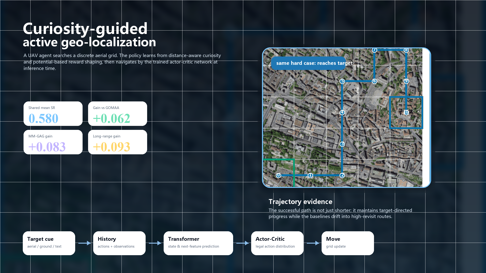
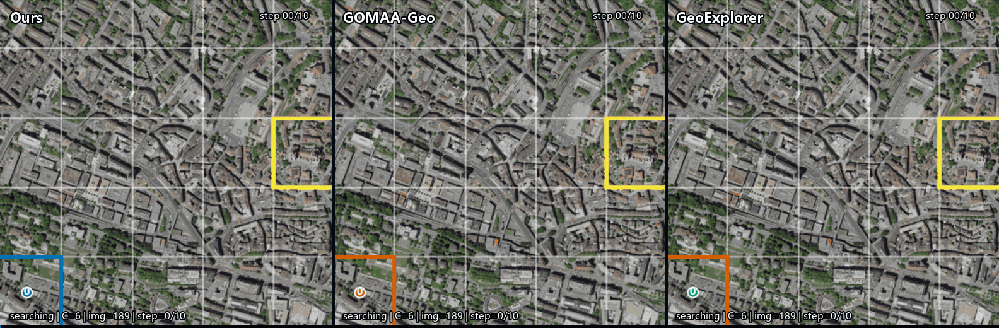
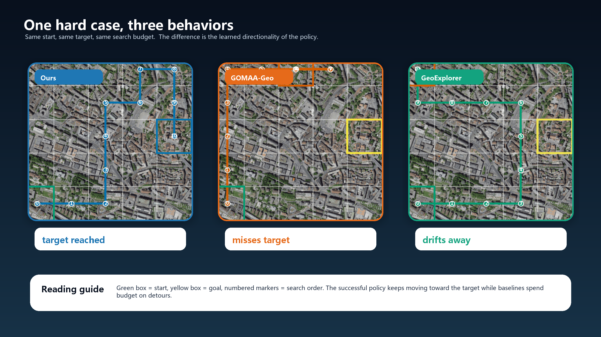
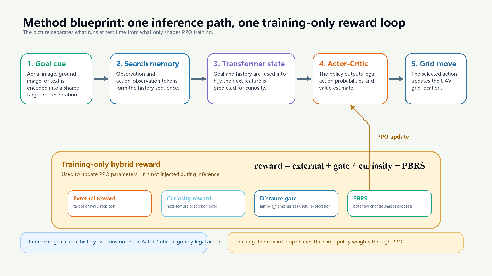
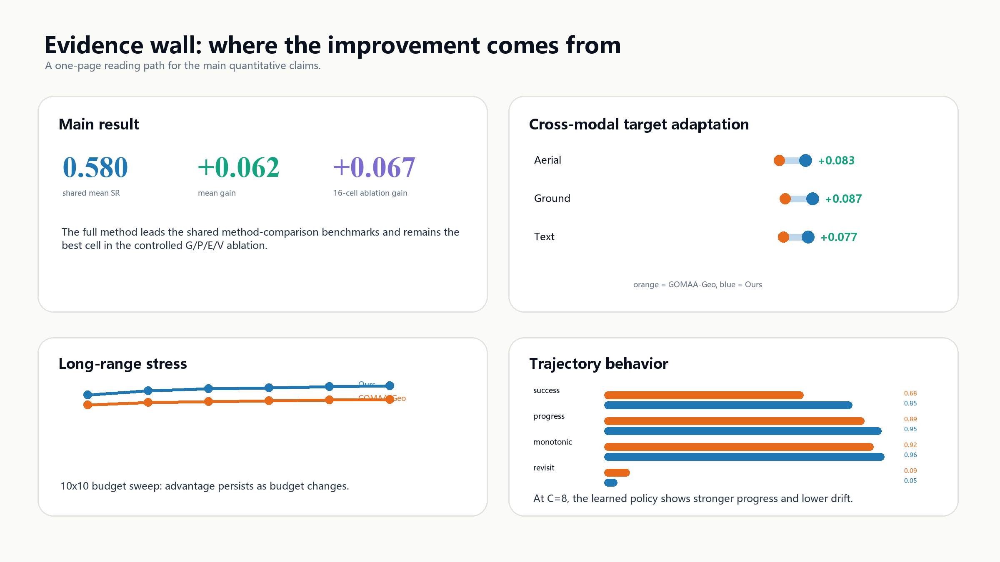
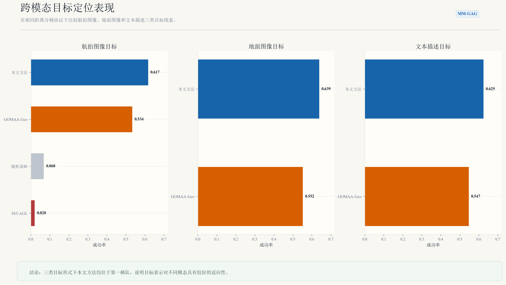
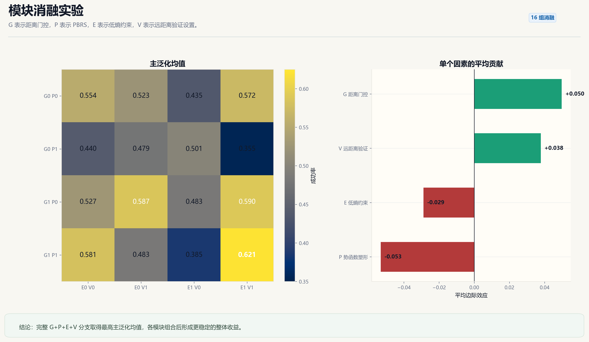
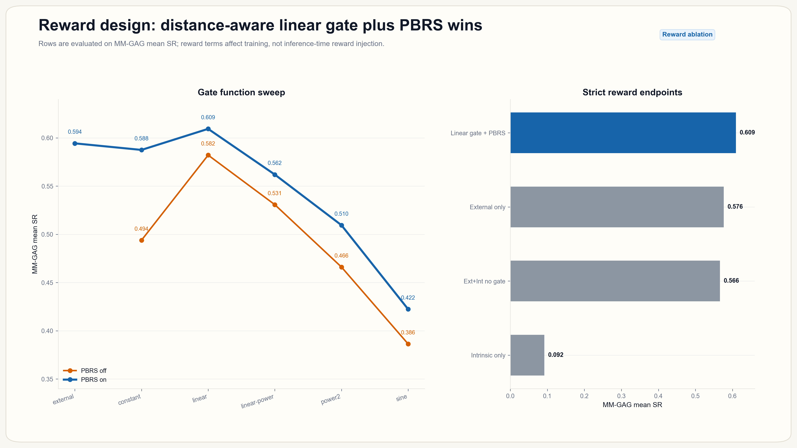
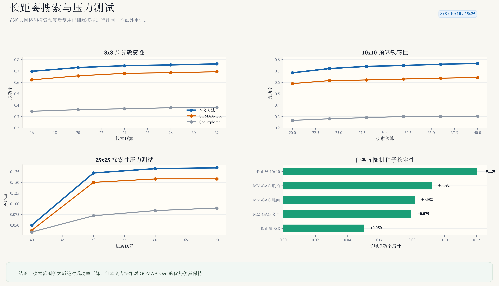

# Undergraduate Graduation Project

<p align="center">
  <b>好奇心驱动的无人机主动目标定位导航方法</b><br>
  Active target geo-localization with distance-aware curiosity reward shaping
</p>

<p align="center">
  
</p>

## 一眼看懂

本仓库整理本科毕业设计《好奇心驱动的无人机主动目标定位导航方法》的代码、实验结果、可视化材料、论文文档和复现说明。任务面向离散网格下的无人机主动目标定位导航：给定航拍搜索区域和目标线索后，智能体从起始网格出发，根据当前位置观测、目标表示和历史搜索序列选择移动动作，并在有限搜索预算内尽可能到达目标网格。

<table>
  <tr>
    <td width="25%" align="center"><b>主基准平均 SR</b><br><code>0.580</code></td>
    <td width="25%" align="center"><b>相对 GOMAA 提升</b><br><code>+0.062</code></td>
    <td width="25%" align="center"><b>MM-GAG 平均提升</b><br><code>+0.083</code></td>
    <td width="25%" align="center"><b>长距离平均提升</b><br><code>+0.093</code></td>
  </tr>
</table>

## 轨迹剧场

下面的 GIF 把同一个困难样例下的三种方法同步放在一张图中。它不是三个独立 GIF 的简单并排，而是统一裁剪、统一步数、统一状态说明和统一进度条，便于直接观察搜索行为差异。

<p align="center">
  
</p>

<p align="center">
  
</p>

## 方法蓝图

本文方法保留 GeoExplorer 的目标编码、历史动作-观测序列建模和 Actor-Critic 策略推理框架，重点改进训练阶段的混合奖励：

```text
r_t = r_ex,t + lambda_t r_in,t + r_p,t
```

其中 `r_ex,t` 为外在目标奖励，`r_in,t` 为下一步特征预测误差构造的好奇心内在奖励，`lambda_t` 为随距离变化的门控权重，`r_p,t` 为势函数奖励塑形项。推理阶段不再计算混合奖励或更新 PPO 参数，只使用训练后的策略网络进行动作选择。

<p align="center">
  
</p>

## 证据墙

这张图把主结果、跨模态目标、长距离压力测试和轨迹行为解释压缩成一页，适合项目首页、答辩开场页或论文补充材料索引页。

<p align="center">
  
</p>

## 结果图卡

旧版普通图表仍完整保留，新版图卡用于快速展示重点结论；完整清单见 [可视化画廊](docs/visualization_gallery_zh.md)。

<table>
  <tr>
    <td width="50%" valign="top">
      <br>
      <b>MM-GAG 跨模态目标</b><br>
      A/G/T 三类目标形式下，本文方法均保持高于 GOMAA-Geo 的成功率。
    </td>
    <td width="50%" valign="top">
      <br>
      <b>机制消融</b><br>
      16 组 G/P/E/V 消融中，完整分支 <code>g1_p1_e1_v1</code> 取得最高主泛化均值。
    </td>
  </tr>
  <tr>
    <td width="50%" valign="top">
      <br>
      <b>奖励机制</b><br>
      线性距离门控与 PBRS 组合在 MM-GAG 平均 SR 上表现最好。
    </td>
    <td width="50%" valign="top">
      <br>
      <b>超长距离与压力测试</b><br>
      8x8、10x10 和 25x25 网格测试展示扩大搜索范围后的相对优势与极端难度。
    </td>
  </tr>
</table>

## 结果与材料组织

- `code/geoexplorer_active/`：本文方法的干净代码入口，包括训练、评测、数据预处理和模型定义。
- `code/tools/build_visual_showcase.py`：从 `results/tables/` 重新生成 GitHub 展示图、experience 图、polished 图卡、同步 GIF 和媒体清单。
- `code/tools/build_showcase_experience.py`：生成首页首屏海报、轨迹剧场、方法蓝图和证据墙。
- `code/tools/build_supplement_experiment_analysis.py`：生成置信区间、轨迹行为、奖励过程和补充实验分析图。
- `experiments/`：主表、消融实验、参数实验和长距离测试对应的脚本与 manifest。
- `results/tables/`：已整理的主实验、消融、附录参数、长距离和轨迹记录表。
- `results/figures/`：论文图、数据集图、轨迹图、奖励机制图和 GitHub 展示图。
- `docs/`：代码结构、实验总结、数据划分、结果索引、复现说明和可视化画廊。
- `thesis/`：论文正文与 Markdown 草稿。
- `materials/`：任务书、开题报告、中期报告、外文翻译等毕设过程材料。

## 复现入口

环境配置：

```bash
cd code/geoexplorer_active
conda env create -f environment.yml
conda activate geoexplorer
```

基础训练与评测入口：

```bash
python pretrain.py
python train.py
python validate.py
```

重新生成展示图：

```bash
python code/tools/build_visual_showcase.py
python code/tools/build_supplement_experiment_analysis.py
```

仓库不包含训练 checkpoint、原始大规模数据包和本地临时缓存。结果表保留 checkpoint 路径或 run 名称，用于和原始实验设置对应；大文件权重需要按复现说明另行准备。

## 文档导航

- [可视化画廊](docs/visualization_gallery_zh.md)
- [实验结果总览](docs/experiment_summary_zh.md)
- [复现说明](docs/reproducibility_zh.md)
- [结果文件索引](docs/result_inventory_zh.md)
- [代码结构说明](docs/code_structure_zh.md)
