# 好奇心驱动的无人机主动定位目标导航方法

这是张洋本科毕业设计《好奇心驱动的无人机主动定位目标导航方法》的项目归档仓库，包含核心代码、实验表格、结果可视化、论文定稿、答辩材料和过程文档。项目面向低空无人机在未知或半未知区域中的主动目标定位任务：给定航拍搜索区域和目标线索，无人机需要在有限步数内边观察、边移动、边修正，逐步接近目标所在网格。

<p align="center">
  
</p>

## 项目概览

本任务不是一次性图像识别，也不是已知终点的路径规划。智能体只能看到当前局部观测、历史动作和目标线索，需要在 `5 x 5` 或更大搜索网格中连续决策。目标线索可以是航拍图像、地面图像，也可以是文本描述；模型将这些线索统一编码，再结合历史状态输入 PPO 策略网络。

方法核心是好奇心驱动的混合奖励机制。外在奖励保证目标导向，好奇心内在奖励补充探索动力，距离调节让策略从远距离主动探索逐步转向近目标收敛。奖励只用于训练阶段；正式测试时，模型只加载训练好的 checkpoint，根据当前状态输出动作。

## 实验设置

实验覆盖 MASA、MM-GAG、SwissView 和 xBD 等数据集，分别对应基础航拍搜索、跨模态目标引导、跨区域未见地标泛化和灾害场景变化。主要设置包括 `5 x 5` 搜索区域、上下左右四类动作、搜索预算 `B=10`、初始距离 `C={4,5,6,7,8}`；长距离扩展实验进一步使用 `10 x 10` 网格验证更大搜索范围和更长路径下的目标导向能力。

## 结果展示

### MASA 建筑纹理相似场景

短距离绕路成功轨迹显示，策略即使中途偏离目标，也能重新修正方向并完成定位。MASA 航拍区域中建筑纹理相似，短距离任务并不总是简单的直接匹配问题。

<p align="center">
  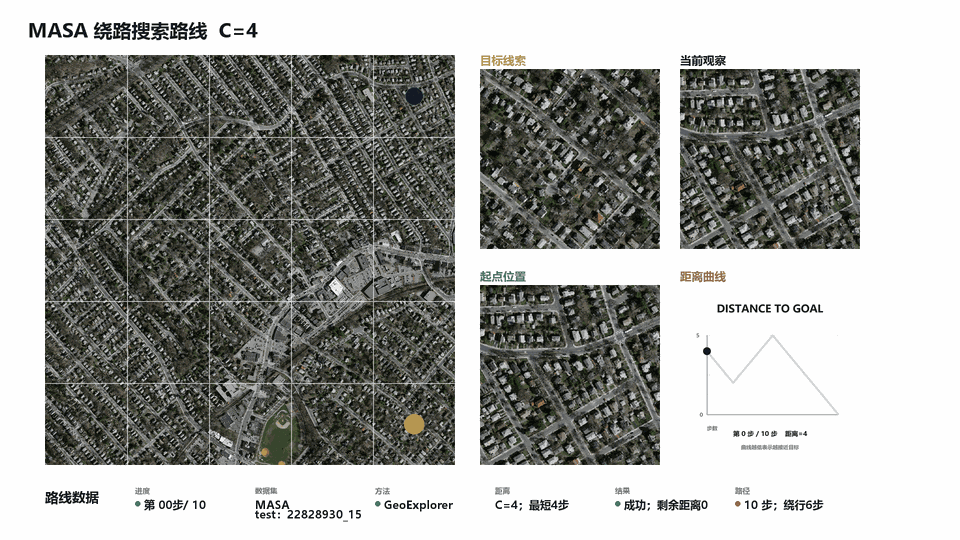
</p>

### SwissView 城镇地标连续搜索

在 SwissView 城镇地标场景中，模型需要面对建筑密集、局部纹理相似的航拍区域。连续搜索过程表明，模型在局部偏移后仍能保持整体目标收敛。

<p align="center">
  
</p>

### SwissView 跨区域湖边长距离搜索

跨区域湖边场景与城镇地标场景在地貌、背景和目标外观上差异明显。长距离可视化结果表明，模型面对不同背景仍能在局部绕行后保持目标收敛趋势。

<p align="center">
  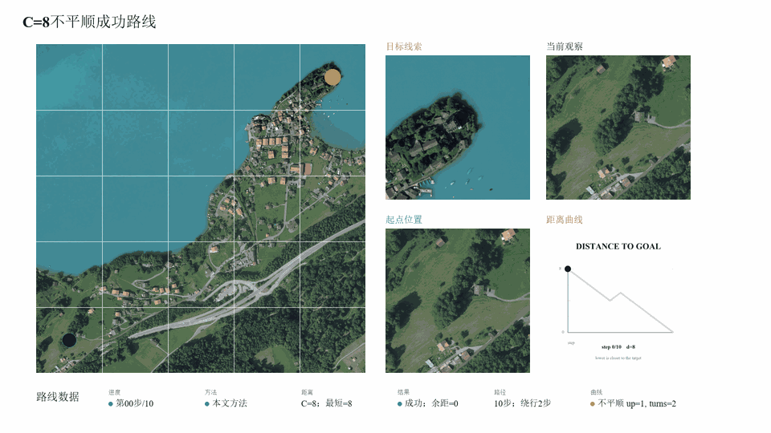
</p>

### MM-GAG 地面图像目标

MM-GAG 地面目标实验测试地面图像作为目标线索时的搜索效果。结果表明，模型具备跨视角目标引导能力，能够把地面视角目标迁移到航拍搜索区域中。

<p align="center">
  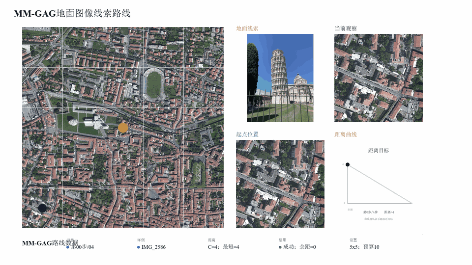
</p>

### MM-GAG 文本描述目标

文本目标实验只给出语义描述而不提供目标图像外观。搜索轨迹显示，统一目标表示能够支持语义目标导航。

<p align="center">
  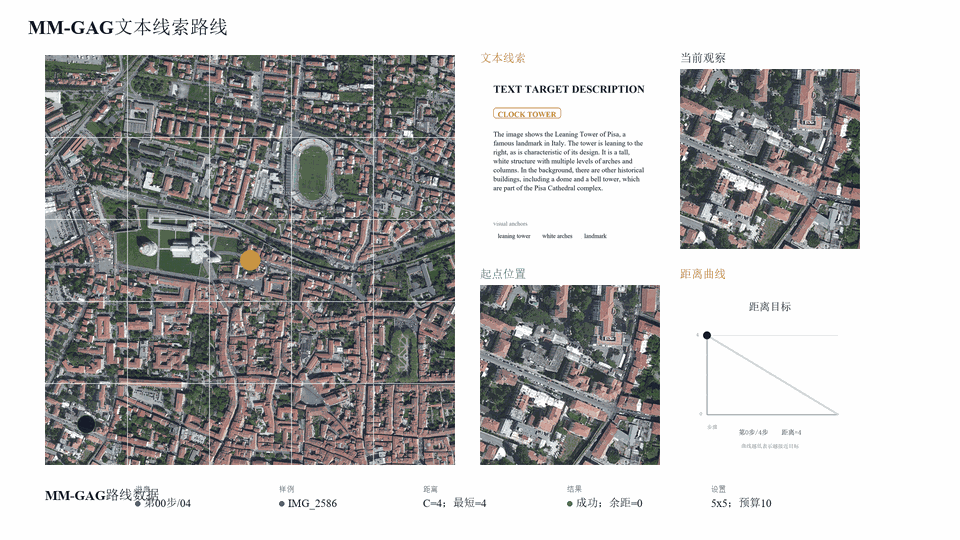
</p>

### xBD 飓风灾后场景

xBD Hurricane Harvey 样例中，灾前目标线索和灾后搜索区域存在明显外观受损与背景变化。模型仍能在灾后航拍场景中执行连续目标搜索。

<p align="center">
  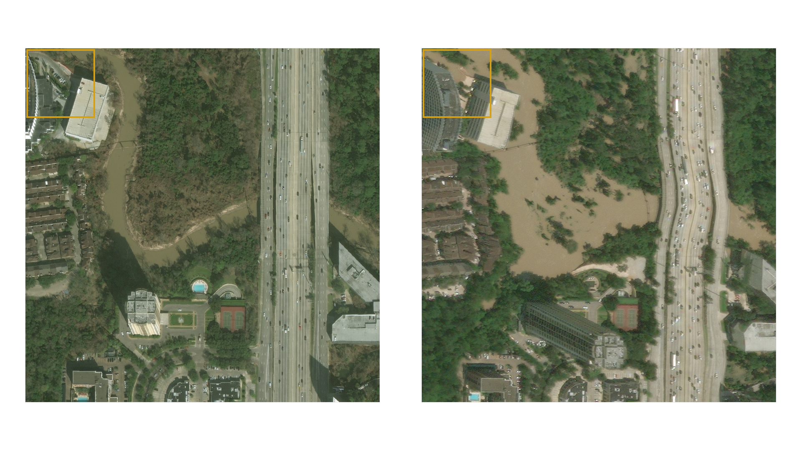
</p>

<p align="center">
  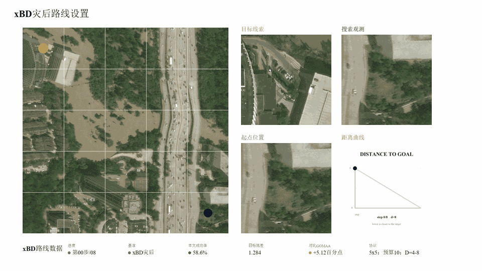
</p>

### xBD 火灾灾后场景

Southern California fire 样例展示了另一类灾害变化：建筑损毁和纹理变化会影响目标线索匹配。不同灾害场景下，模型仍能够执行连续目标搜索。

<p align="center">
  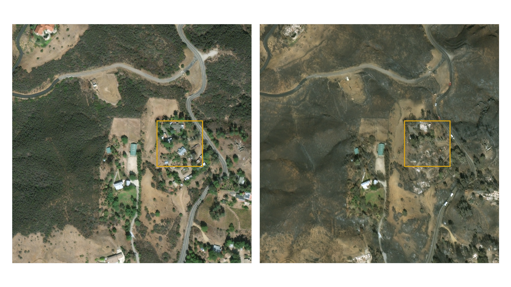
</p>

<p align="center">
  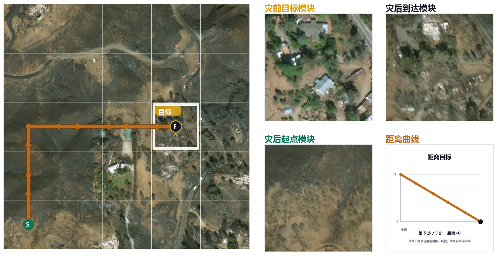
</p>

### 10 x 10 长距离扩展搜索

在更大搜索范围和更长搜索路径下，模型仍保持较强目标导向。长距离、跨场景、固定搜索边界下的连续决策能力，是本方法相对于简单目标匹配策略更有价值的部分。

<p align="center">
  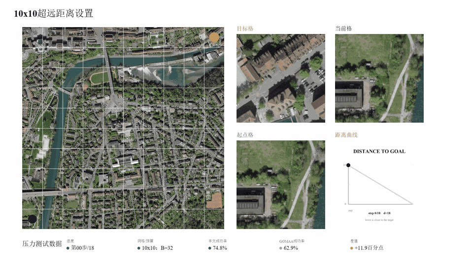
</p>

### 短距离失败边界

短距离失败案例显示，局部相似模块会诱导策略在相邻区域之间徘徊，造成末端定位波动。这一结果说明短距离并不是本文方法的优势区间，也解释了部分短距离指标波动。

<p align="center">
  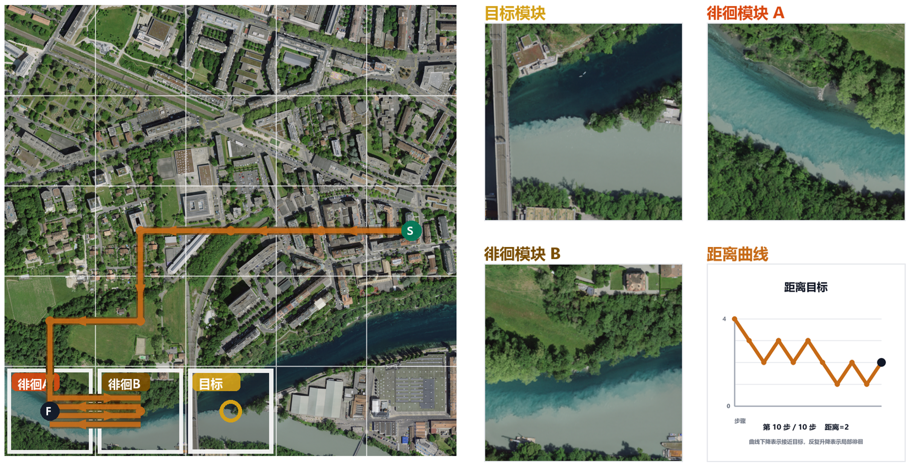
</p>

## 实验分析

性能对比实验的结论可以概括为三点：成功率整体更高，长远距离优势突出，短距离存在波动。随着搜索距离增加，稀疏反馈和路径偏移问题更加明显，好奇心奖励能够持续提供探索与收敛引导；短距离任务中目标更容易被直接匹配，部分目标匹配方法可能快速命中，而好奇心奖励保留一定探索倾向，因此会出现效果波动。

<p align="center">
  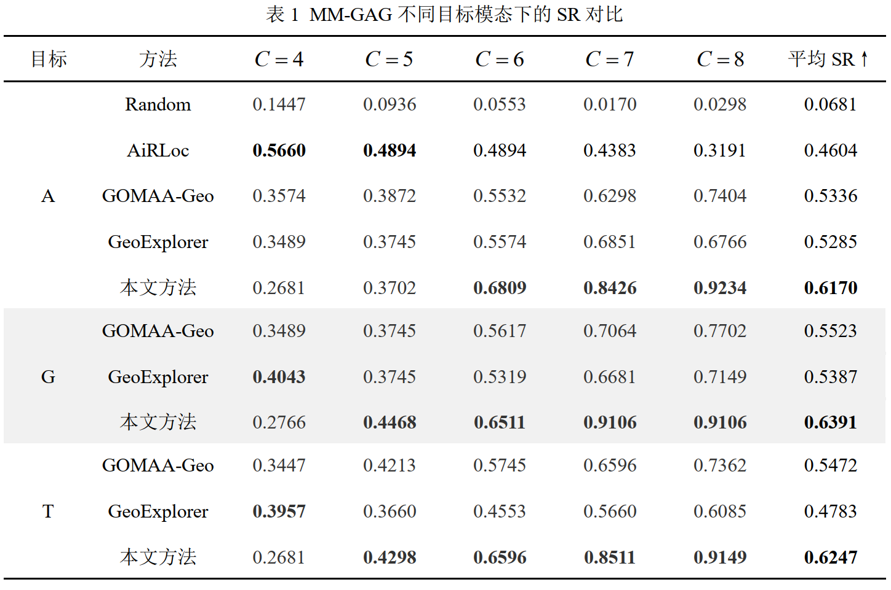
</p>

奖励分距离分析展示训练阶段接近/偏离动作的平均单步总奖励。合理的距离门控让远距离阶段保留探索正反馈，近目标阶段抑制回退，使奖励方向与目标收敛保持一致。

<p align="center">
  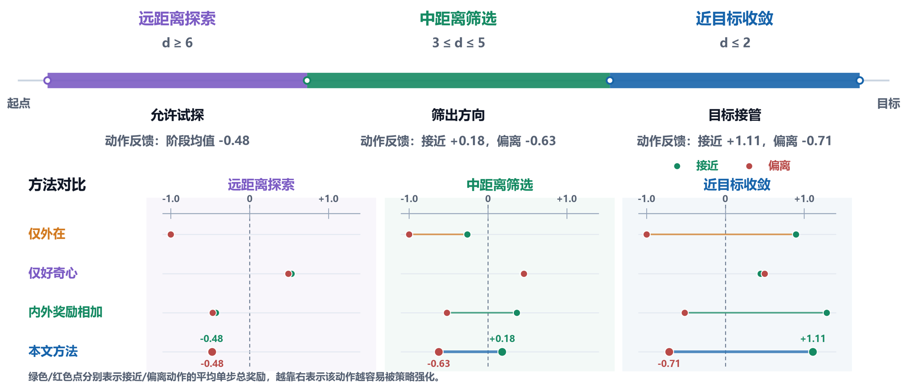
</p>

消融实验表明，不同奖励模块在不同距离上作用不同。外在奖励能提供直接目标反馈；好奇心奖励鼓励主动探索；距离调节函数和势函数塑形强化中长距离接近信号。完整方法的优势主要体现在中长距离、多步搜索和跨模态目标线索场景。

<p align="center">
  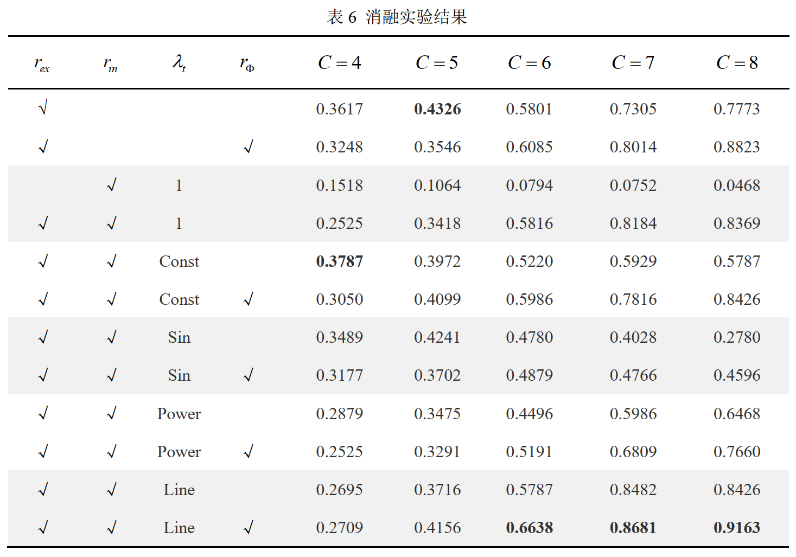
</p>

## 仓库内容

- `code/geoexplorer_active/`：核心代码入口。
- `code/tools/`：结果整理、可视化生成、服务器验收、短距离评估和答辩素材生成脚本。
- `docs/`：代码结构、实验复现、结果索引、服务器验收、PPT 汇报脉络和结题经验总结。
- `results/tables/`：主实验、消融实验、补充实验、轨迹行为和短距离评估表格。
- `results/reports/`：实验总结、奖励机制分析、续训诊断、验收演示和短距离边界报告。
- `results/figures/defense_readme_20260613/`：最终答辩展示用的压缩动图与静态图。
- `archives/raw_results_20260613/`：不直接展示的大批原始结果材料压缩归档索引；45 个 ZIP 大包保存在 GitHub Release 附件中，内容包含验收演示、奖励分析、PPT 候选图、展示图、实验报告、表格、日志和离线分析脚本。
- `thesis/`：论文 Word 版、Markdown 草稿和正式 PDF。
- `materials/project_admin/`：任务书、开题、中期、验收表、外文翻译和题目变更说明等过程材料。
- `materials/defense/`：结题答辩 PDF。
- `materials/quality/`：AIGC 检测报告与原始报告包。

## 复现与验收

基础训练与评估入口：

```bash
cd code/geoexplorer_active
conda env create -f environment.yml
conda activate geoexplorer
python pretrain.py
python train.py
python validate.py
```

服务器验收脚本已整理到 `code/tools/`。远端部署时使用环境变量或安全凭据传入登录信息，不要把密码、token 或 cookie 写入仓库。

常用验收命令：

```bash
/root/geoexplorer/run_acceptance_demo
/root/geoexplorer/run_acceptance_demo --visual-only
/root/geoexplorer/run_acceptance_case_pack
/root/geoexplorer/run_acceptance_train --status
/root/geoexplorer/run_c123_eval
```

## 进一步阅读

- [结题收尾总览](docs/project_closing_summary_zh.md)
- [PPT 汇报脉络](docs/defense_ppt_storyline_zh.md)
- [论文与过程材料索引](docs/thesis_material_index_zh.md)
- [原始结果压缩归档说明](archives/raw_results_20260613/README.md)
- [服务器验收指南](docs/server_acceptance_guide_zh.md)
- [实验结果总览](docs/experiment_summary_zh.md)
- [结果文件索引](docs/result_inventory_zh.md)
- [可视化结果画廊](docs/visualization_gallery_zh.md)
- [复现说明](docs/reproducibility_zh.md)
