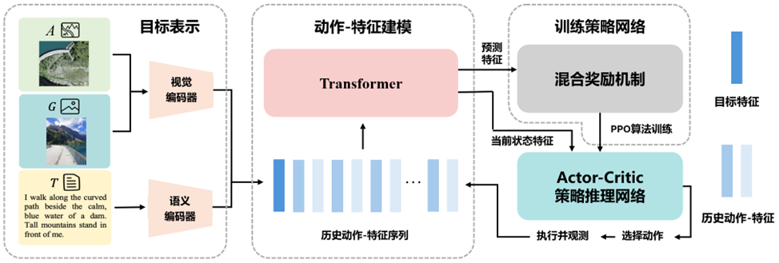
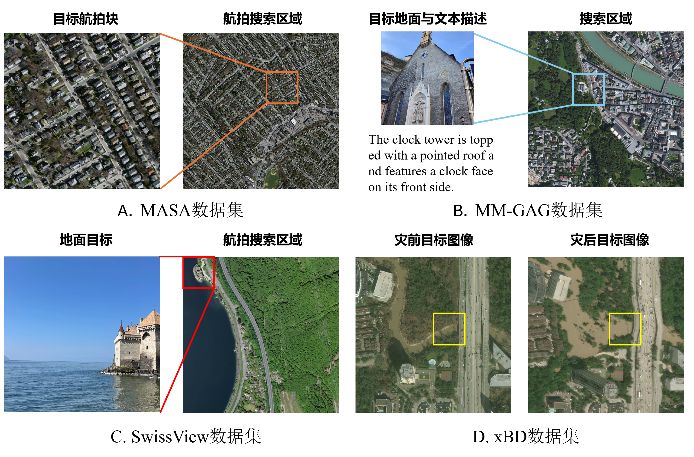

# Undergraduate Graduation Project

<p align="center">
  <b>好奇心驱动的无人机主动目标定位导航方法</b><br>
  Active target geo-localization with distance-aware curiosity reward shaping
</p>

<p align="center">
  
</p>

## 项目概览

本仓库整理本科毕业设计《好奇心驱动的无人机主动目标定位导航方法》的代码、实验结果、可视化材料、论文文档和过程材料。任务面向离散网格下的无人机主动目标定位导航：给定航拍搜索区域和目标线索后，智能体从起始网格出发，根据当前位置观测、目标表示和历史搜索序列选择移动动作，并在有限搜索预算内尽可能到达目标网格。

<table>
  <tr>
    <td width="25%" align="center"><b>主基准平均 SR</b><br><code>0.580</code></td>
    <td width="25%" align="center"><b>相对 GOMAA 提升</b><br><code>+0.062</code></td>
    <td width="25%" align="center"><b>MM-GAG 平均提升</b><br><code>+0.083</code></td>
    <td width="25%" align="center"><b>长距离平均提升</b><br><code>+0.093</code></td>
  </tr>
</table>

## 方法框架

方法由三部分组成：首先将航拍图像、地面图像或文本描述编码为统一的目标表示；随后用 Transformer 建模历史动作与观测特征序列；最后由 Actor-Critic 策略网络根据当前状态和历史信息选择下一步动作。混合奖励机制只用于训练阶段优化策略，推理阶段直接使用训练好的策略网络。

<p align="center">
  
</p>

## 数据集与任务场景

实验材料覆盖航拍目标、地面目标、文本目标和灾前灾后场景。下面的图用于快速说明不同数据设置对应的目标线索和搜索区域形式。

<p align="center">
  
</p>

## 轨迹对比

下面的 GIF 把同一个困难样例下的三种方法同步放在一张图中，便于直接观察不同策略在搜索过程中的行为差异。

<p align="center">
  
</p>

<p align="center">
  
</p>

## 核心结果

证据墙把总体性能、跨模态目标、长距离搜索和轨迹行为放在同一页中，用来快速说明本文方法的提升来自哪些实验现象。完整数值以 `results/tables/` 中的表格为准。

<p align="center">
  
</p>

### 结果总览

<p align="center">
  
</p>

### 跨模态目标定位

<p align="center">
  
</p>

### 模块消融实验

<p align="center">
  
</p>

### 奖励设计分析

<p align="center">
  
</p>

### 长距离搜索与压力测试

<p align="center">
  
</p>

### 轨迹行为统计

<p align="center">
  
</p>

## 仓库结构

- `code/main/`：本文方法的干净代码入口，包括训练、评测、数据预处理和模型定义。
- `code/tools/`：图表生成、结果整理和验收材料处理脚本。
- `experiments/`：主表、消融实验、参数实验和长距离测试对应的脚本与 manifest。
- `results/tables/`：已整理的主实验、消融、附录参数、长距离和轨迹记录表。
- `results/figures/`：论文图、答辩展示图、轨迹图、奖励机制图和 GitHub 展示图。
- `results/reports/`：实验报告、协议说明和可视化整理说明。
- `docs/`：代码结构、实验总结、结果索引、复现说明和材料索引。
- `materials/`：最终论文、答辩材料、任务书、开题、中期、外文翻译、质量检查和正式过程材料。
- `archives/`：不适合直接铺在仓库首页的大型原始结果包索引，文件主体通过 GitHub Release 保存。

## 复现入口

环境配置：

```bash
cd code/main
conda env create -f environment.yml
conda activate code
```

基础训练与评测入口：

```bash
python pretrain.py
python train.py
python validate.py
```

重新生成展示图：

```bash
python code/tools/build_visual_showcase.py
python code/tools/build_supplement_experiment_analysis.py
```

仓库不包含训练 checkpoint、原始大规模数据包和本地临时缓存。结果表保留 checkpoint 路径或 run 名称，用于和原始实验设置对应；大文件权重需要按复现说明另行准备。

## 文档导航

- [可视化画廊](docs/visualization_gallery_zh.md)
- [实验结果总览](docs/experiment_summary_zh.md)
- [复现说明](docs/reproducibility_zh.md)
- [结果文件索引](docs/result_inventory_zh.md)
- [论文与过程材料索引](docs/thesis_material_index_zh.md)
- [代码结构说明](docs/code_structure_zh.md)
