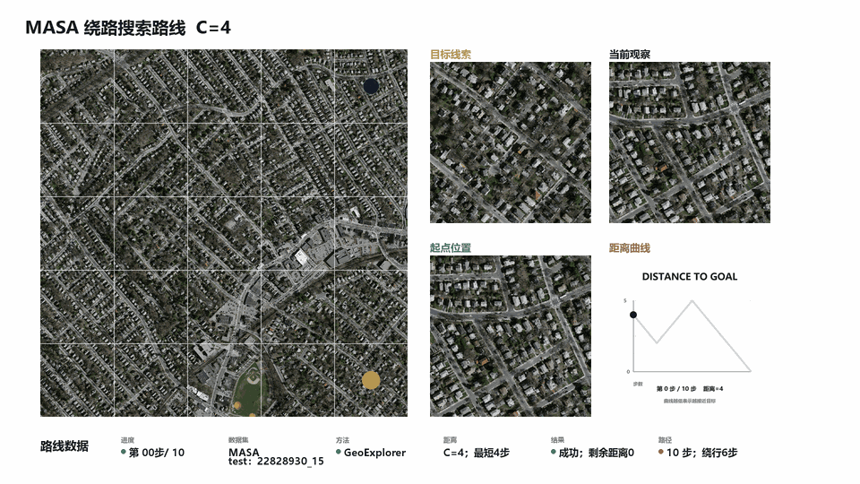
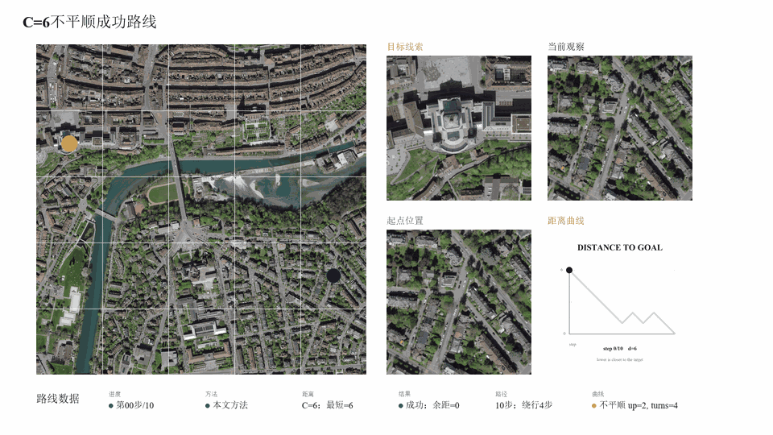
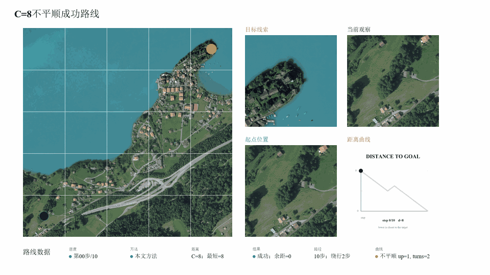
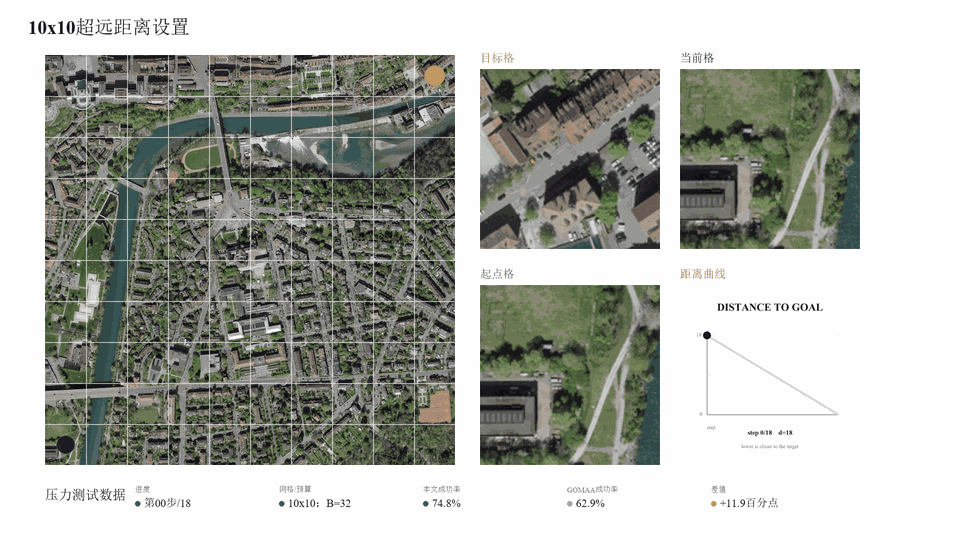
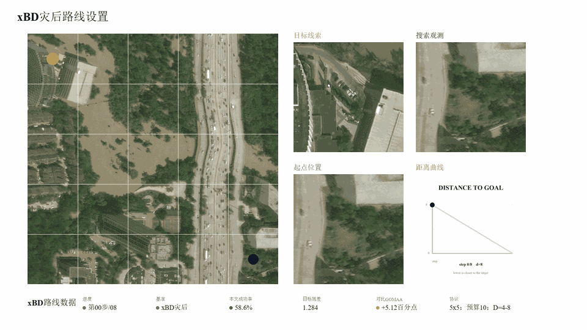
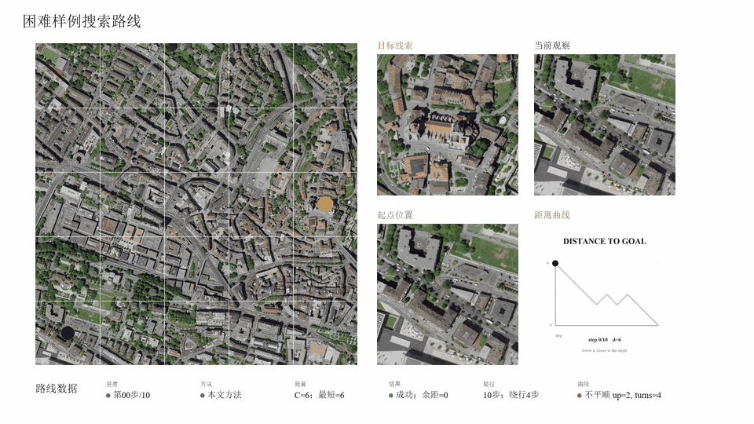
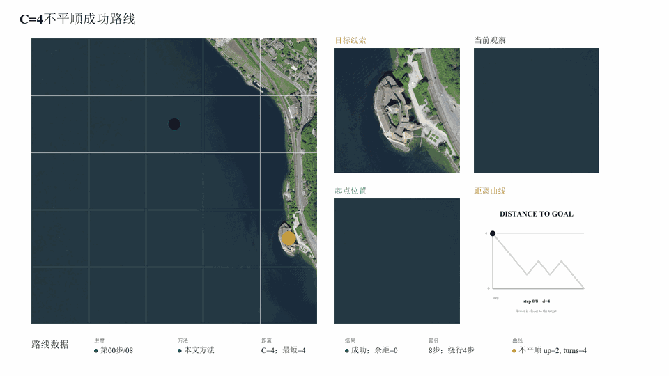
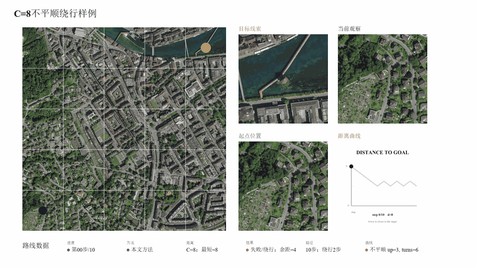

# ???????????????????

<p align="center">
  <b>??????????????????????????????</b><br>
  Active target geo-localization with distance-aware curiosity reward shaping
</p>

<p align="center">
  
</p>

## ????

???????????????????????????????????????????????????????????????????????????????????????????????????????????????????????????????????????????????????????

<table>
  <tr>
    <td width="25%" align="center"><b>????? SR</b><br><code>0.580</code></td>
    <td width="25%" align="center"><b>?? GOMAA ??</b><br><code>+0.062</code></td>
    <td width="25%" align="center"><b>MM-GAG ????</b><br><code>+0.083</code></td>
    <td width="25%" align="center"><b>???????</b><br><code>+0.093</code></td>
  </tr>
</table>

## ????

?????????????????????????????????????????????????? Actor-Critic ??????????????????????????????????????????????????????????????????????

<p align="center">
  
</p>

## PPT ????

???????????????????????????????????????????????????????????????????????????????????????????????????????????????????????????????????????????????

### ????????

<p align="center">
  
  
</p>

### ??????????

<p align="center">
  
  
</p>

### ?????????

<p align="center">
  
</p>

### ???????

<p align="center">
  
  
</p>

### ??????

<p align="center">
  
  
</p>

## ???????

????????????????????????????????????????????????????????????????????? `results/tables/` ????? `results/reports/` ?????????

<p align="center">
  
</p>

<p align="center">
  
  
</p>

## ??????

????????????????????????????????????????????????????? C4/C6/C8 ??????????????????

<p align="center">
  
</p>

<p align="center">
  
  
  
</p>

## ????

- `code/main/`????????????????????????????????
- `code/tools/`????????????????????
- `experiments/`????????????????????????? manifest?
- `results/tables/`???????????????????????????
- `results/figures/`????????????????????? GitHub ????
- `results/reports/`???????????????????
- `docs/`??????????????????????????
- `materials/`??????????????????????????????????????
- `data/swissview_sample/`?SwissView ???????????????????????
- `archives/`????????????????????????????? GitHub Release ???

## ????

?????

```bash
cd code/main
conda env create -f environment.yml
conda activate code
```

??????????

```bash
python pretrain.py
python train.py
python validate.py
```

????????

```bash
python code/tools/build_visual_showcase.py
python code/tools/build_supplement_experiment_analysis.py
```

??????? checkpoint?????????????????????? checkpoint ??? run ????????????????????????????????

## ????

- [???? PPT ????](docs/defense_ppt_storyline_zh.md)
- [?????](docs/visualization_gallery_zh.md)
- [??????](docs/experiment_summary_zh.md)
- [????](docs/reproducibility_zh.md)
- [??????](docs/result_inventory_zh.md)
- [?????????](docs/thesis_material_index_zh.md)
- [??????](docs/code_structure_zh.md)
