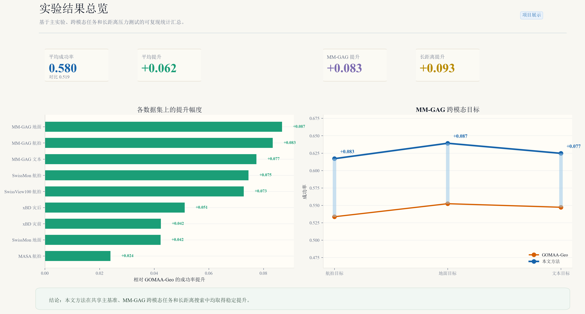
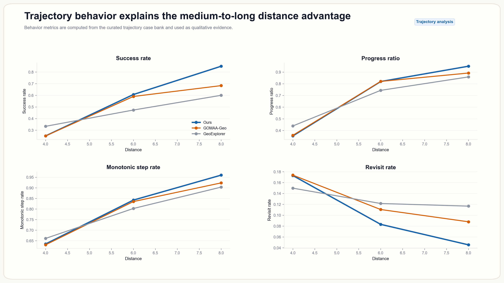
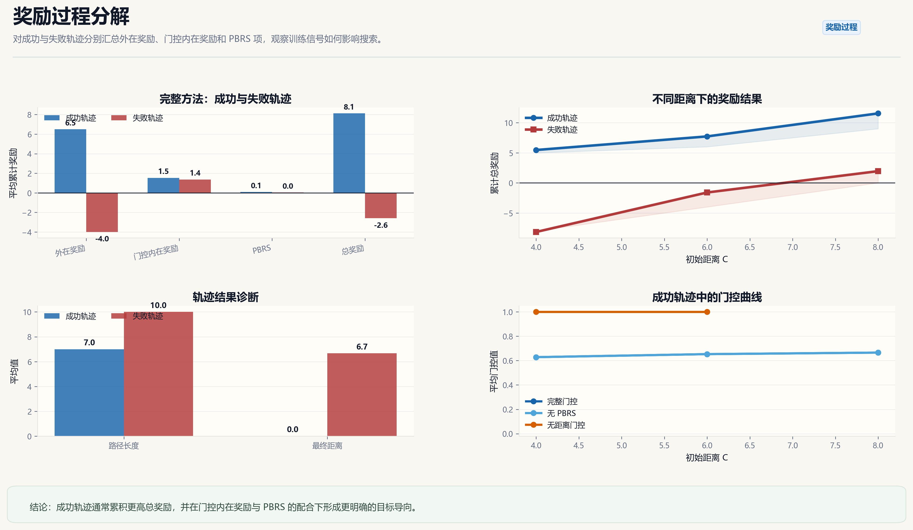
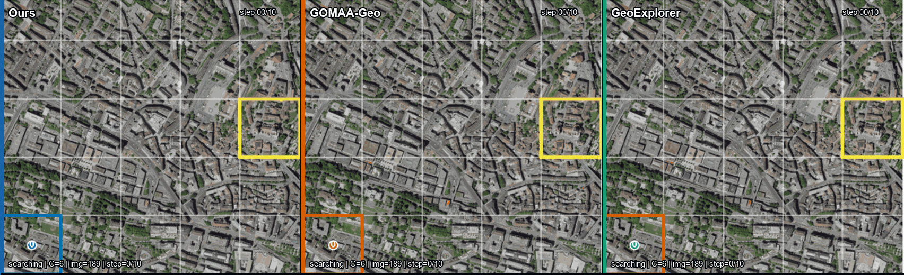
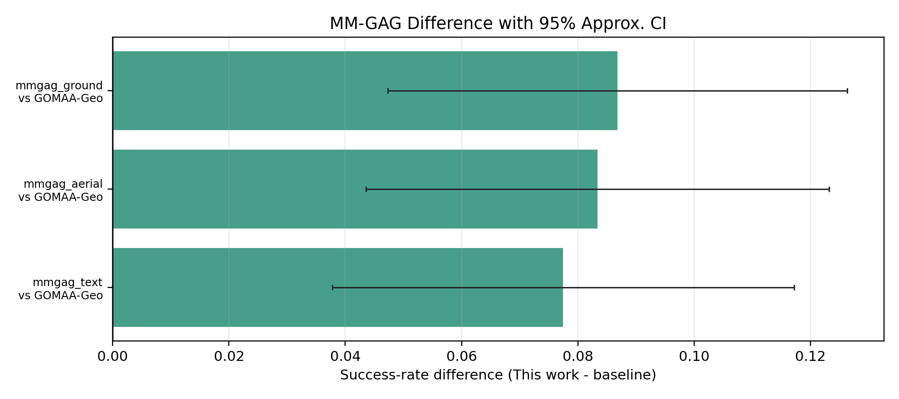
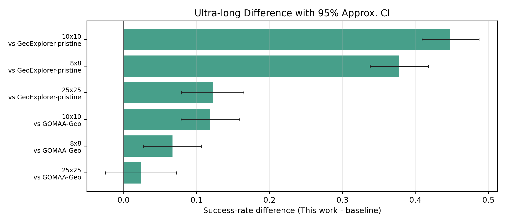
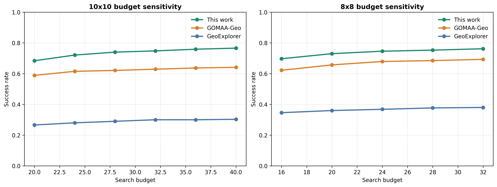
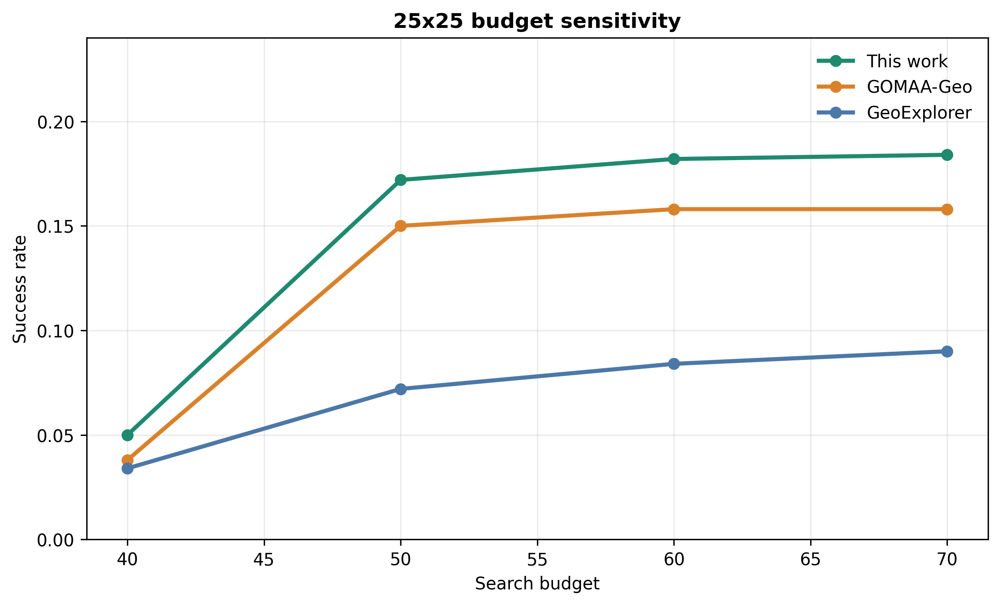
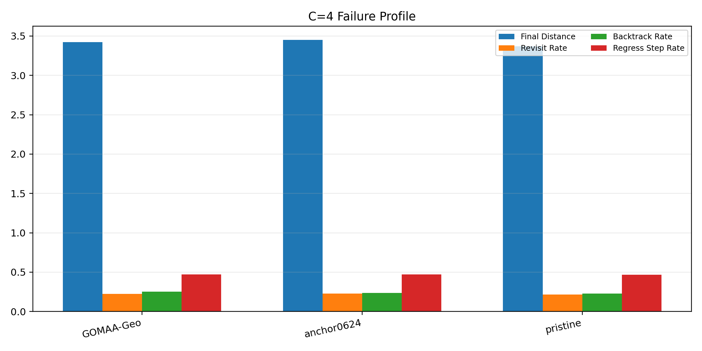
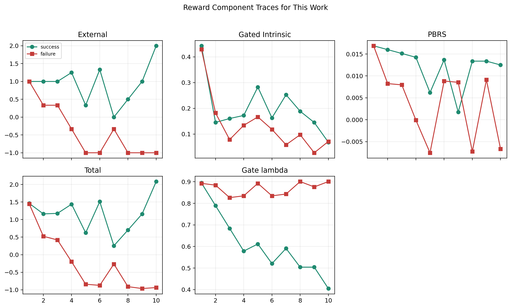

# 可视化结果画廊

本画廊整理项目展示页、论文补充材料和答辩展示可直接使用的图件。当前展示层分为两级：`experience/` 用于 GitHub 首页首屏、轨迹剧场和方法叙事；`polished/` 用于可复现的科研风格结果图卡。这样既保留数据表驱动的严谨性，也避免首页只像普通统计图堆叠。

## 生成方式

```bash
python code/tools/build_visual_showcase.py
```

该脚本会读取 `results/tables/` 中的真实实验结果表，重新生成基础展示图、experience 首页资产、polished 图卡、同步三联 GIF，并复制轨迹与奖励机制媒体。新版核心文件位于 `results/figures/showcase/experience/`、`results/figures/showcase/polished/` 和 `results/figures/showcase/trajectories/triptych_gifs/`。

## Experience 首页资产

这些图用于项目首页和答辩开场页，目标是先讲清楚“任务是什么、方法强在哪、轨迹为什么更稳”。

<p align="center">
  
</p>

<table>
  <tr>
    <td width="50%" valign="top">
      <br>
      <b>方法蓝图</b><br>
      将推理路径和训练阶段混合奖励回路分开，避免把奖励机制误解为推理阶段也参与计算。
    </td>
    <td width="50%" valign="top">
      <br>
      <b>证据墙</b><br>
      将主结果、跨模态、长距离和轨迹行为压缩为一页阅读路径。
    </td>
  </tr>
</table>

<p align="center">
  
</p>

<p align="center">
  
</p>

## Polished 核心图卡

<table>
  <tr>
    <td width="50%" valign="top">
      <br>
      <b>总览图</b><br>
      用主基准平均 SR、平均提升、MM-GAG 提升和长距离提升概括项目主要结论。
    </td>
    <td width="50%" valign="top">
      <br>
      <b>MM-GAG 跨模态</b><br>
      对比航拍图像目标、地面图像目标和文本目标下的 SR，展示跨模态目标适应性。
    </td>
  </tr>
  <tr>
    <td width="50%" valign="top">
      <br>
      <b>机制消融</b><br>
      展示 16 组 G/P/E/V 消融热力图和四个因子的平均主效应。
    </td>
    <td width="50%" valign="top">
      <br>
      <b>奖励设计</b><br>
      比较不同门控函数与 PBRS 开关，同时给出外在/内在奖励端点对比。
    </td>
  </tr>
  <tr>
    <td width="50%" valign="top">
      <br>
      <b>长距离与压力测试</b><br>
      展示 8x8、10x10 和 25x25 网格下的预算敏感性与任务库随机种子稳定性。
    </td>
    <td width="50%" valign="top">
      <br>
      <b>轨迹行为分析</b><br>
      用成功率、距离缩短率、单调接近率和重复访问率解释中远距离优势。
    </td>
  </tr>
  <tr>
    <td colspan="2" valign="top">
      <br>
      <b>奖励过程补充</b><br>
      将外在奖励、门控内在奖励、PBRS、总奖励和门控值放入统一图卡，便于解释混合奖励为什么主要在训练阶段改善搜索策略。
    </td>
  </tr>
</table>

## 同步三联动图

三联动图将同一案例下的 Ours、GOMAA-Geo 和 GeoExplorer 轨迹同步放在一张 GIF 中。每一帧共享统一标题、方法标签、边框和步数标记，适合项目首页、答辩页和补充材料快速展示。

<p align="center">
  
</p>

可用三联动图清单：

| 案例 | 文件 |
| --- | --- |
| C=4 failure/detour | `results/figures/showcase/trajectories/triptych_gifs/c4_anchor_failure_or_detour__img025_d4_s12_g00_r0__triptych.gif` |
| C=4 success | `results/figures/showcase/trajectories/triptych_gifs/c4_anchor_success__img011_d4_s03_g11_r0__triptych.gif` |
| C=6 failure/detour | `results/figures/showcase/trajectories/triptych_gifs/c6_anchor_failure_or_detour__img050_d6_s14_g00_r0__triptych.gif` |
| C=6 success | `results/figures/showcase/trajectories/triptych_gifs/c6_anchor_success__img006_d6_s24_g06_r0__triptych.gif` |
| C=8 failure/detour | `results/figures/showcase/trajectories/triptych_gifs/c8_anchor_failure_or_detour__img054_d8_s20_g04_r0__triptych.gif` |
| C=8 success | `results/figures/showcase/trajectories/triptych_gifs/c8_anchor_success__img000_d8_s24_g00_r0__triptych.gif` |
| Three-method hard case | `results/figures/showcase/trajectories/triptych_gifs/three_method_hardcase__img189_d6_s20_g14_r0__triptych.gif` |

## 论文补充分析图

<table>
  <tr>
    <td width="50%" valign="top">
      <br>
      <b>MM-GAG 差值置信区间</b><br>
      展示 A/G/T 三种目标模态下本文方法相对 GOMAA-Geo 的 SR 差值及近似 95% CI。
    </td>
    <td width="50%" valign="top">
      <br>
      <b>长距离差值置信区间</b><br>
      展示 8x8/10x10 长距离扩展测试中的相对提升。
    </td>
  </tr>
  <tr>
    <td width="50%" valign="top">
      <br>
      <b>P0 预算敏感性</b><br>
      展示 8x8/10x10 下预算变化对 SR 的影响。
    </td>
    <td width="50%" valign="top">
      <br>
      <b>25x25 压力测试</b><br>
      展示极端大网格下预算变化、相对领先和绝对困难性。
    </td>
  </tr>
  <tr>
    <td width="50%" valign="top">
      <br>
      <b>C=4 失败画像</b><br>
      支撑“方法优势集中在中远距离，短距离不一定占优”的解释。
    </td>
    <td width="50%" valign="top">
      <br>
      <b>奖励过程曲线</b><br>
      展示外在奖励、门控内在奖励、PBRS 和总奖励随步数变化的趋势。
    </td>
  </tr>
</table>

## 原始展示图与素材索引

旧版基础图仍保留在 `results/figures/showcase/`，包括 `benchmark_overview_dashboard.png`、`mmgag_modality_sr.png`、`distance_bucket_curves.png`、`generalization_heatmap_16cell.png`、`reward_gate_pb_comparison.png`、`parameter_sensitivity_curves.png`、`ultra_long_sr_curves.png`、`grid25_stress_curves.png` 等。这些图继续作为可复现中间结果保存，但项目首页优先使用 polished 图卡。

轨迹媒体目录：

- `results/figures/showcase/trajectories/triptych_gifs/`：7 个新版同步三联动图。
- `results/figures/showcase/trajectories/gifs/`：21 个原始单方法轨迹 GIF。
- `results/figures/showcase/trajectories/comparison_png/`：7 张三方法静态对比图。
- `results/figures/showcase/trajectories/static_png/`：21 张单方法静态轨迹图。

奖励机制图目录：

- `results/figures/showcase/reward_story/`：机制示意、G/P 2x2 路径对比、奖励矩阵、结果矩阵和奖励回放 GIF。

## 使用建议

- 项目首页优先使用 `polished/hero_dashboard.png`、`polished/mmgag_modality_panel.png`、`polished/ablation_story_panel.png`、`polished/reward_design_panel.png`、`polished/long_range_panel.png` 和一张 triptych GIF。
- 答辩展示优先使用 PNG 和 GIF；论文正文可继续使用 SVG/PDF 或从源表重新导出。
- 主表结论以 `results/tables/` 中的 CSV/JSON 为准，展示图用于帮助读者快速理解趋势。
